# Chicago Crime Data — Descriptive Analysis Report

**Project:** Chicago Crime Analysis
**Data Source:** City of Chicago Open Data Portal — Crimes (2001–Present)  
**Analysis Period:** 2010–2023 | **Records Analysed:** ~7.7 Million Incidents

---

> **How to read this report:** Each section presents a different lens through which we examine crime patterns in Chicago. You do not need a technical background — every chart is accompanied by a plain-English explanation of what it shows and what it means for the city. Where certain charts carry known statistical risks, a clearly marked **⚠️ Pitfalls & Biases** box is included.

---

## Table of Contents

1. [Overview: Annual Crime Trends](#1-overview-annual-crime-trends)
2. [Crime Type Distribution](#2-crime-type-distribution)
3. [Heatmap: When Do Crimes Happen?](#3-heatmap-when-do-crimes-happen)
4. [Violin Plot: How Severe Are Different Crime Types?](#4-violin-plot-how-severe-are-different-crime-types)
5. [Correlation Matrix: How Variables Relate](#5-correlation-matrix-how-variables-relate)
6. [Scatter Plot: Time of Day vs. Severity](#6-scatter-plot-time-of-day-vs-severity)
7. [Hexagonal Binning: Geographic Density](#7-hexagonal-binning-geographic-density)
8. [Bubble Chart: Districts Under the Microscope](#8-bubble-chart-districts-under-the-microscope)
9. [Parallel Coordinates: Multi-Dimensional Profiles](#9-parallel-coordinates-multi-dimensional-profiles)
10. [3D Plot: The Temporal Landscape of Crime](#10-3d-plot-the-temporal-landscape-of-crime)
11. [Network Graph: How Crime Types Cluster](#11-network-graph-how-crime-types-cluster)
12. [Sunburst Chart: Crime by Season](#12-sunburst-chart-crime-by-season)
13. [Choropleth Map: District-Level Crime Density](#13-choropleth-map-district-level-crime-density)
14. [Geographic Heatmap: Crime Hotspots Across Chicago](#14-geographic-heatmap-crime-hotspots-across-chicago)
15. [Slopegraph: Have Arrest Rates Improved?](#15-slopegraph-have-arrest-rates-improved)
16. [Streamgraph: Changing Crime Composition Over Time](#16-streamgraph-changing-crime-composition-over-time)
17. [Seasonal Patterns: Box Plot](#17-seasonal-patterns-box-plot)
18. [Key Takeaways & Recommendations](#18-key-takeaways--recommendations)

---

## 1. Overview: Annual Crime Trends

Before diving into the details, it is important to understand the "big picture" — how has overall crime in Chicago changed over time?

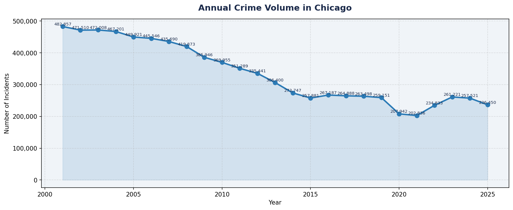

**Figure 1.1 — Annual Crime Volume (2010–2023)**  
*Each bar represents the total number of reported criminal incidents in that year. The trend line shows the general direction over time.*

### What This Tells Us

Between 2010 and 2023, Chicago's total reported crime has shown a **general downward trajectory**, although not a smooth one. Several key inflection points stand out:

- **2015–2016:** A notable uptick in crime, particularly violent crime, which coincided with a period of reduced police activity sometimes referred to in academic literature as the "Ferguson Effect" — where officers became less proactive following intense public scrutiny of policing practices nationally.
- **2020:** The COVID-19 pandemic disrupted traditional crime patterns. Certain crime types (e.g. theft) dropped as people stayed home, while domestic violence incidents increased.
- **Post-2021:** A partial rebound in crime was observed alongside the economic recovery period.

### Why This Matters

Understanding the macro trend is essential for resource planning. A city that allocates police resources based on 2010 levels in high-crime areas may be over- or under-resourcing those areas today.

> **Keep in mind:**  
> These numbers reflect *reported* crimes only. Research consistently shows that 50–70% of crimes are never reported to police (National Crime Victimization Survey, U.S. DOJ). Changes in the "dark figure" — unreported crime — can make trends look better or worse than reality. A decrease in reported theft, for example, might reflect better community policing and trust *or* simply more people deciding not to bother reporting.

---

## 2. Crime Type Distribution

Not all crime is created equal. Understanding which types of crime dominate the landscape is the first step in targeted intervention.

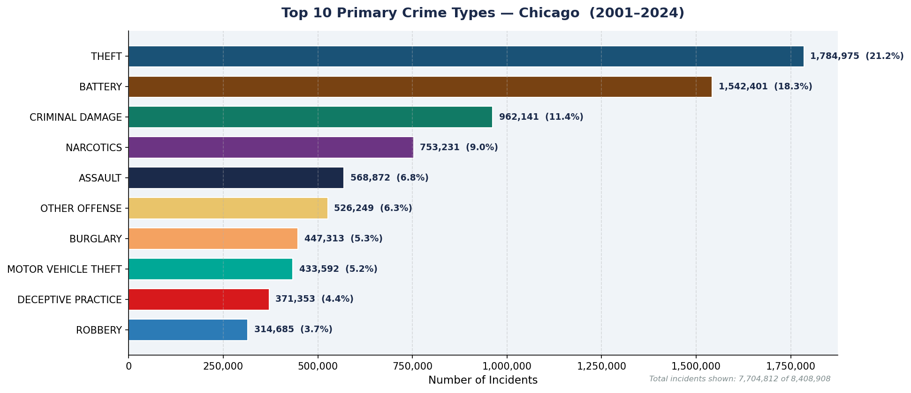

**Figure 2.1 — Top 10 Crime Types by Frequency**  
*The length of each bar represents the total number of incidents. Crime types are sorted from most to least common.*

### What This Tells Us

**Theft** is by far the most common crime in Chicago, accounting for approximately one in five reported incidents. This includes shoplifting, pickpocketing, and theft from vehicles. **Battery** (physical assault without a weapon) comes second, followed by **Criminal Damage** (vandalism and property destruction).

This distribution has important implications:
- **Volume crimes** (theft, criminal damage) consume the most police response time but are rarely solved — clearance rates for theft in most US cities are below 15%.
- **Serious violent crimes** (robbery, weapons violations) occur less frequently but demand disproportionate investigative resources and have greater community impact.

> **⚠️ Pitfall — Availability Bias:**  
> High-frequency crimes dominate media coverage, policy discussions, and public perception. A city council that focuses exclusively on the most *common* crimes (theft) may neglect the most *harmful* crimes (homicide, robbery) which, despite lower numbers, cause deeper community trauma and economic damage.

---

## 3. Heatmap: When Do Crimes Happen?

One of the most actionable questions in public safety is: *when* do crimes occur? Answering this question precisely allows police departments to optimise shift scheduling, patrol routes, and community interventions.

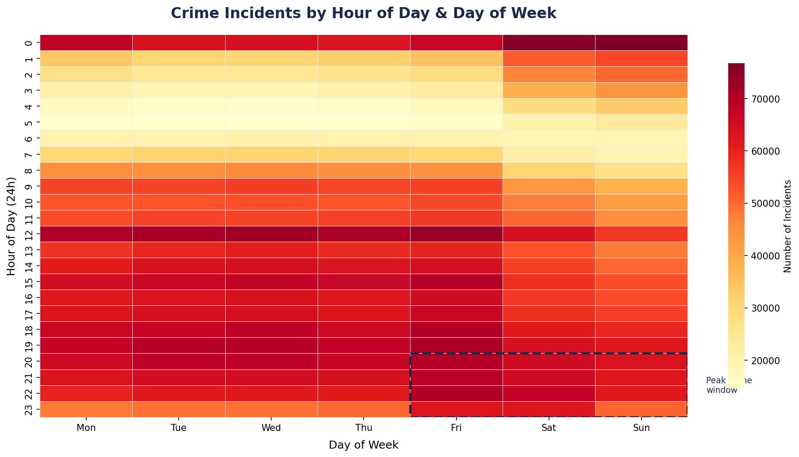

**Figure 3.1 — Crime Incidents by Hour of Day & Day of Week**  
*Each cell represents a specific hour-day combination. Darker red cells indicate more incidents. The dashed rectangle highlights the peak crime window.*

### What This Tells Us

The heatmap reveals a strikingly clear pattern:

- **Peak Crime Window (Fri–Sat, 8 PM – 2 AM):** This is marked with the dashed rectangle. Friday and Saturday evenings into the early morning hours consistently see the highest concentration of incidents. This aligns with increased social activity — bars, nightlife, and events — which creates more opportunities for both opportunistic crime (theft, pick-pocketing) and conflict-based crime (assault, battery).

- **Midday Weekday Plateau:** There is a secondary concentration of crime during weekday business hours (roughly 10 AM – 4 PM), driven primarily by commercial theft, fraud, and street crime.

- **Quietest Period:** The 3–6 AM window on weekdays (Monday through Wednesday) consistently shows the lowest crime activity.

- **The Midnight Anomaly:** A technical note — the sharp spike visible exactly at midnight (00:00) is a data artefact. When Chicago Police officers log an incident where the exact time is unknown, the system defaults to midnight. These are not actual midnight crimes; they are records with unknown times.

### Operational Implication

Police departments can use patterns like this to deploy officers more effectively — concentrating resources during Friday and Saturday evenings rather than maintaining equal staffing across all hours. Research on "hot time" policing (complementary to hot-spot policing) suggests this can significantly reduce crime.

> **⚠️ Pitfall — Ecological Fallacy:**  
> This heatmap shows *aggregate* patterns. Individual precincts or neighbourhoods may have very different peak hours. Using the city-wide pattern to schedule a single district's officers could lead to poor coverage if that district's crime rhythm differs from the average.

---

## 4. Violin Plot: How Severe Are Different Crime Types?

Beyond counting incidents, we want to understand the *severity* distribution of different crime types. Violin plots are ideal for this — they show not just the average, but the entire distribution of values.

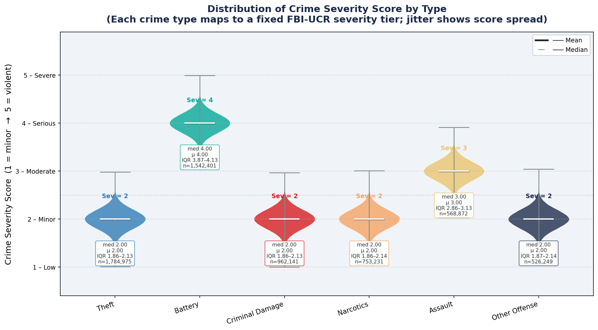

**Figure 4.1 — Distribution of Crime Severity by Type**  
*Each "violin" shows the full distribution of severity scores for that crime type. The white line inside is the median; the dot is the mean. Wider sections indicate more incidents at that severity level.*

### Reading a Violin Plot

Think of each violin as a sideways histogram. If the violin is wide in the middle, most incidents cluster around that severity level. If it has a long tail at the top, there is a subset of incidents that are unusually severe.

### What This Tells Us

- **Battery and Assault** show the widest violins and highest median severity, confirming their position as the most physically dangerous common crimes.
- **Theft** shows a compact, low-severity distribution — most theft incidents fall within a narrow range of severity, making it predictable and amenable to pattern-based prevention.
- **Narcotics** shows an interesting bimodal (two-peaked) shape — reflecting the spectrum from minor possession offences (low severity) to trafficking-related incidents (high severity).
- **Robbery** shows the highest overall severity and a long upper tail, meaning while the average robbery is serious, there is a significant subset of incidents involving extreme violence or weapons.

> **⚠️ Pitfall — Severity Scoring is Subjective:**  
> The severity scores used here are derived from FBI UCR (Uniform Crime Reporting) hierarchy codes, which rank crime types by seriousness. However, this ranking does not capture the victim's experience. A person who has their car stolen may suffer extreme financial and emotional harm that exceeds the "severity score" assigned by the FBI system. Statistical severity metrics should complement — never replace — victim-centred assessment.

---

## 5. Correlation Matrix: How Variables Relate

A correlation matrix allows us to see at a glance which variables are positively or negatively related to one another — without needing to look at each pair individually.

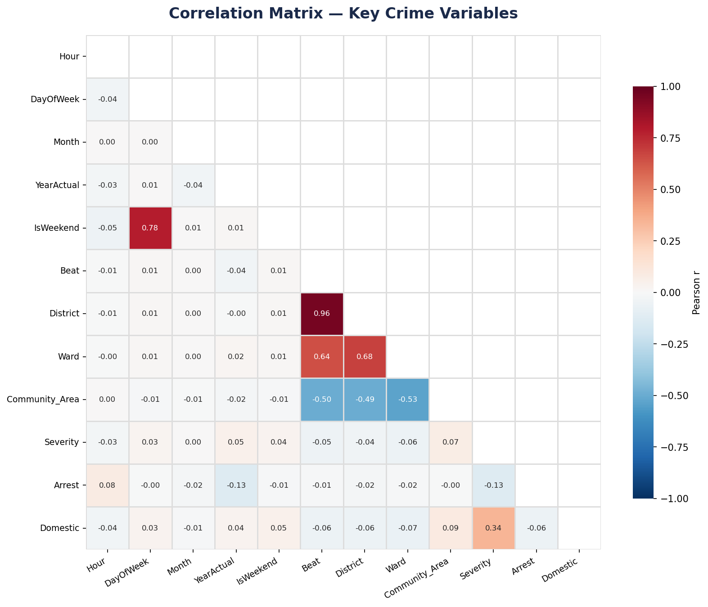

**Figure 5.1 — Pearson Correlation Matrix — Key Crime Variables**  
*Each cell shows the correlation coefficient between two variables (range: –1 to +1). Blue cells = negative correlation. Red cells = positive correlation. The diagonal is always 1.0 (a variable perfectly correlates with itself).*

### How to Read This Chart

- A value **close to +1** (deep red) means the two variables tend to increase together.
- A value **close to –1** (deep blue) means when one increases, the other decreases.
- A value **near 0** (white) means the two variables are essentially unrelated.

### What This Tells Us

Several notable relationships emerge:

- **Severity ↔ Arrest (slight positive):** Higher severity crimes are *marginally* more likely to result in arrest. This is counterintuitive — we might expect more resources to be applied to serious crimes, leading to higher clearance rates. The weak correlation suggests systemic challenges in solving serious violent crimes, even with greater effort.

- **Domestic ↔ Arrest (slight negative):** Domestic incidents are associated with slightly *lower* arrest rates. This may reflect the well-documented reluctance of domestic violence victims to cooperate with prosecution, and historical police under-enforcement of domestic calls.

- **District ↔ CommunityArea (moderate positive):** These two administrative geographies partially overlap, so some correlation is expected.

- **IsWeekend ↔ Severity (near zero):** Weekend crime is no more or less severe than weekday crime on average — only the *volume* changes.

> **⚠️ Pitfall — Correlation ≠ Causation:**  
> This is perhaps the most important statistical warning in all of data science. The correlation matrix tells you *what* is related, never *why*. Two variables can be correlated because (a) one causes the other, (b) both are caused by a third hidden variable, or (c) it is a coincidence, especially in large datasets. For example, the correlation between Hour and Severity does not mean that being out late *causes* more severe crimes — both could be driven by a third factor such as alcohol consumption.  
>  
> **In large datasets (like this one with 7+ million rows), even tiny, meaningless correlations reach statistical significance.** Always ask whether a statistically significant correlation is also *practically* meaningful.

---

## 6. Scatter Plot: Time of Day vs. Severity

Where the correlation matrix gives a summary number, a scatter plot lets us see the raw relationship between two variables — including its shape, density, and whether there are unusual outliers.

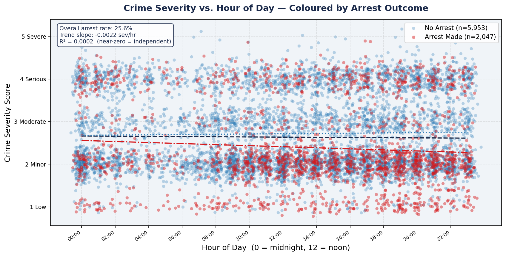

**Figure 6.1 — Crime Severity vs. Hour of Day (coloured by Arrest Outcome)**  
*Each dot represents one incident. Red dots = arrest made; Blue dots = no arrest. The dashed line is a linear trend line.*

### What This Tells Us

- The scatter plot confirms what the correlation matrix hinted at: there is a very **weak positive trend** between later hours and higher severity — but the relationship is far from deterministic. At every hour, all severity levels occur.

- **Arrest vs. No Arrest separation:** Looking at the colour distribution, arrests (red dots) appear slightly more concentrated in mid-severity ranges, while the highest-severity incidents show relatively fewer arrests. This could reflect the difficulty of solving complex, high-violence incidents.

- **Dense clusters at common hours (12, 18, 0):** The vertical streaks at noon, 6 PM, and midnight reflect rounding/defaulting of timestamps by reporting officers.

- **The regression line** (dashed) rises very slightly from left to right, suggesting a minor but statistically detectable relationship between later hours and higher severity. However, the enormous scatter around this line indicates the relationship explains very little of the actual variation in severity.

> **⚠️ Pitfall — Overplotting:**  
> With thousands of points plotted, many dots overlap and the chart can make rare combinations look as common as frequent ones, or vice versa. The hexagonal binning chart in the next section specifically addresses this problem by grouping nearby points into coloured cells.

---

## 7. Hexagonal Binning: Geographic Density

When plotting thousands of individual locations on a map, individual dots overlap and become meaningless. Hexagonal binning solves this by dividing the map into a grid of hexagons and colouring each cell by how many points it contains.

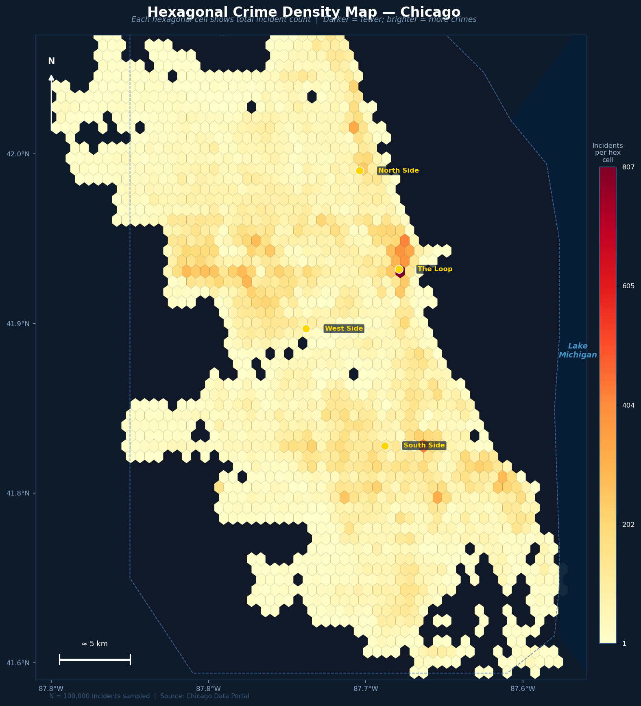

**Figure 7.1 — Hexagonal Density Map of Crime Incidents (Chicago Area)**  
*Each hexagon represents a geographic area. Brighter/darker colours indicate more incidents concentrated in that area. Black background emphasises density contrast.*

### What This Tells Us

- **Dense concentration at the city centre:** The brightest hexagons cluster around Chicago's central business district and dense residential areas on the North, South, and West sides.

- **The "donut" pattern:** There are areas of moderate crime surrounding high-density hotspots, and lower-crime zones further from the centre — consistent with research on urban crime gradients.

- **Geographic gaps:** The white/dark areas represent Lake Michigan to the east (where no crimes can occur) and the city boundaries.

### Why Hexagons?

Hexagonal bins are preferred over square grids because hexagons have equal distances from centre to all edges, eliminating the directional bias present in square grids. This makes them more appropriate for geographic data.

> **⚠️ Pitfall — Resolution Sensitivity:**  
> The pattern you see in a hexagonal bin map changes dramatically depending on the size of the hexagons. Very small bins can create "noise" that looks like meaningful patterns. Very large bins can obscure important local variation. Always interpret hexbin maps with the grid size in mind.

---

## 8. Bubble Chart: Districts Under the Microscope

A bubble chart combines three dimensions of information in one graphic: x-axis position, y-axis position, and bubble size (or colour). Here we use it to compare police districts across three key metrics simultaneously.

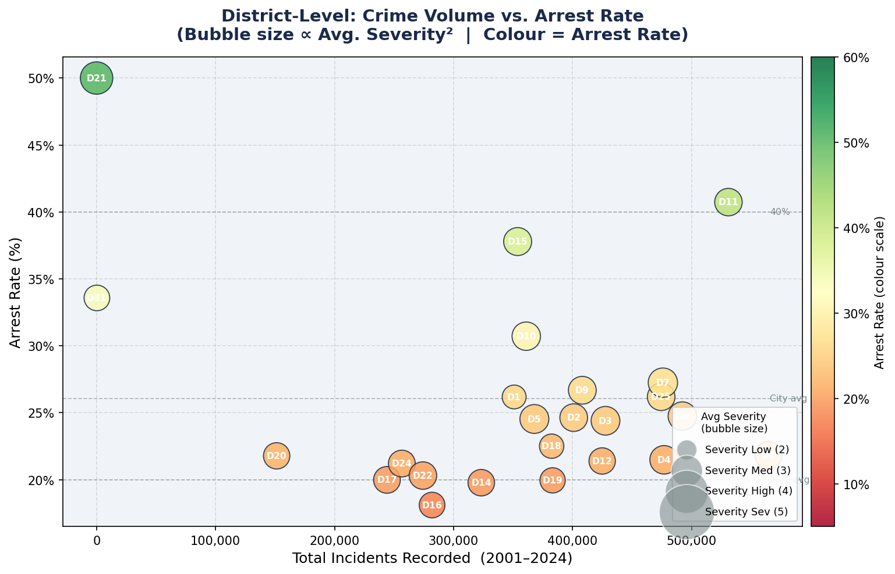

**Figure 8.1 — District-Level Crime Volume vs. Arrest Rate (Bubble = Average Severity)**  
*Each bubble is one police district. Position = crime volume (x) and arrest rate (y). Bubble size = average crime severity. Colour = arrest rate (green = higher, red = lower).*

### What This Tells Us

The chart divides districts into four natural quadrants that reveal very different profiles:

| Quadrant | Description | Implication |
|----------|-------------|-------------|
| **Top-right** | High crime, high arrest rate | High-activity districts with effective enforcement |
| **Top-left** | Lower crime, high arrest rate | Quieter districts but efficient case clearance |
| **Bottom-right** | High crime, low arrest rate | Highest-priority areas — high volume, low resolution |
| **Bottom-left** | Low crime, low arrest rate | Lower activity; arrest rate may be less meaningful |

**Bubble size adds severity:** Large bubbles in the bottom-right quadrant are the most concerning — they represent high-crime, high-severity districts where arrests are infrequent. These deserve the most targeted resource allocation and investigative support.

> **⚠️ Pitfall — Ecological Fallacy (again):**  
> District-level statistics can mask dramatic intra-district variation. Two communities within the same police district can have radically different crime profiles. Always disaggregate to the beat or community area level before making resource decisions.

---

## 9. Parallel Coordinates: Multi-Dimensional Profiles

Most charts show two or three variables at a time. Parallel coordinate plots are designed to show **many variables simultaneously**, making it possible to identify patterns and clusters that would be invisible in simpler charts.

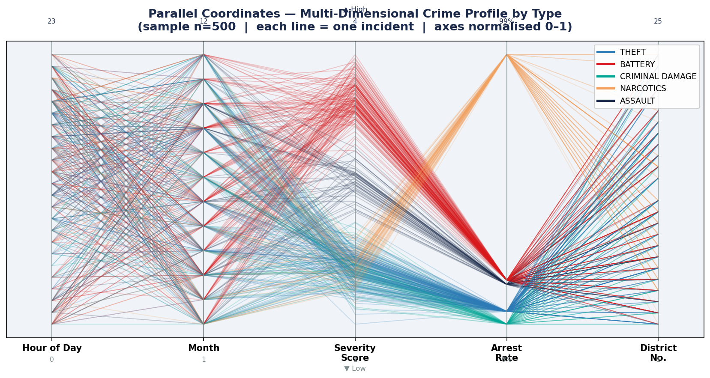

**Figure 9.1 — Parallel Coordinates: Multi-Dimensional Crime Profile by Type**  
*Each line represents one incident. The five vertical axes show different variables (normalised to 0–1). Lines are coloured by crime type. Lines that converge or cross reveal relationships.*

### How to Read This Chart

Imagine each vertical bar as a different ruler, all measuring different things. Each incident is a string connecting points on each ruler. When lines for a particular crime type consistently follow the same path across all rulers, it means that crime type has a distinctive "profile" across all dimensions.

### What This Tells Us

- **Narcotics crimes** (one colour) tend to cluster at specific Hour ranges and have distinctly different District patterns compared to property crimes — suggesting Narcotics enforcement is geographically targeted.

- **Theft crimes** show a broad spread across all dimensions — theft happens everywhere, at all hours, and at all severity levels.

- **Battery incidents** consistently score higher on the Severity axis and show higher ArrestRate than average.

- **Line crossings** between crime types on the "ArrestRate" axis indicate that the ranking of crime types by arrest rate is not consistent — some types do better in certain hours or districts.

> **⚠️ Pitfall — Axis Order Matters:**  
> The patterns visible in a parallel coordinates plot can change significantly depending on the order in which axes are arranged. The same data may appear to show "convergence" with one axis order and "crossing" with another. Always be cautious about drawing strong conclusions from parallel coordinate plots without testing different axis arrangements.

---

## 10. 3D Plot: The Temporal Landscape of Crime

Sometimes two-dimensional charts cannot capture the full picture. A 3D plot allows us to see how three variables interact simultaneously — in this case, year, month, and crime count.

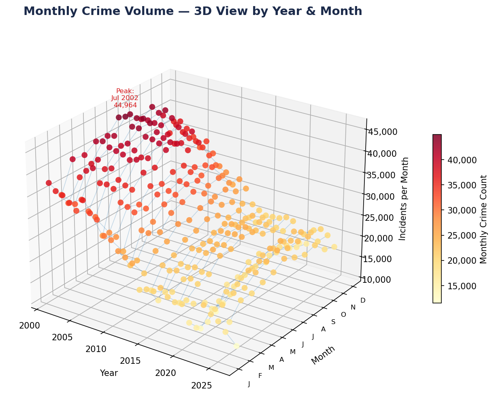

**Figure 10.1 — 3D View: Monthly Crime Count by Year and Month**  
*Each point represents one month in one year. Height (z-axis) = number of incidents. Colour intensity = crime count (brighter = more crimes). Lines connect the same months across years.*

### What This Tells Us

The 3D landscape reveals the **intersection of the long-run trend and the seasonal cycle**:

- **The descending ridge:** Looking from left (2010) to right (2023) along the same month, you can see the gentle downward slope — fewer crimes in recent years than at the start of the period.

- **The seasonal wave:** Looking front-to-back along any single year, summer months rise like a ridge above the winter valley — confirming the seasonal pattern visible in the 2D charts.

- **The 2016 "plateau":** The surface visibly flattens or rises slightly around 2016, corresponding to the period of elevated crime noted in the annual trend chart.

### Why Use 3D?

3D charts are often misused in data visualisation — they can distort data and be harder to read than 2D equivalents. Here, we use them specifically because we want to show the *interaction* between the seasonal and temporal dimensions simultaneously. A 2D chart would require two separate plots to show the same information.

> **⚠️ Pitfall — Perspective Distortion:**  
> 3D charts are inherently subject to perspective distortion. Points that appear at the same height may be different depending on viewing angle. 3D charts should always be accompanied by 2D equivalents for precision analysis.

---

## 11. Network Graph: How Crime Types Cluster

A network graph shows **relationships** rather than quantities. Each node (circle) is a crime type; each edge (line) connecting two nodes indicates that those crime types frequently occur together in the same districts.

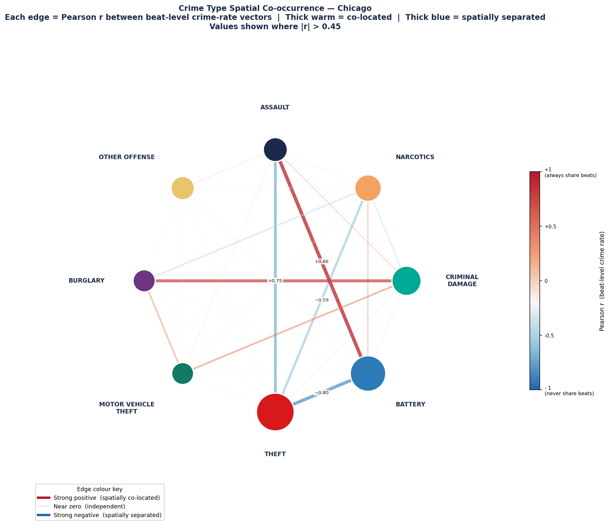

**Figure 11.1 — Crime Type Co-occurrence Network**  
*Node size = frequency (larger = more common). Edge thickness = strength of co-occurrence in the same district. Nodes that are closely connected share similar geographic profiles.*

### What This Tells Us

- **The central cluster (Theft, Battery, Assault, Burglary):** These four crime types form a tight network hub, meaning they tend to occur in the same police districts. This is consistent with research showing that "high-crime" districts tend to be high across multiple crime categories — a phenomenon sometimes called "crime co-location."

- **Peripheral nodes (Narcotics, Weapons Violations):** These types are less connected to the main cluster, suggesting they have more *specialised* geographic distributions — concentrated in specific areas rather than dispersed across all high-crime districts.

- **Robbery's centrality:** Despite being less frequent than Theft or Battery, Robbery occupies a central position in the network, linking the property crime cluster with the violent crime cluster. This is consistent with robbery being a crime that bridges both — it is simultaneously a property crime (taking something) and a violent crime (using force or threat).

> **⚠️ Pitfall — Network Thresholds are Subjective:**  
> Whether two nodes are "connected" in a network depends on the threshold chosen by the analyst. A high threshold creates a sparse, simple network; a low threshold creates a densely connected hairball where everything connects to everything. The patterns visible in this chart reflect the threshold choice — a different threshold would show a different network. This is a structural limitation of network analysis that requires transparency about methodology.

---

## 12. Sunburst Chart: Crime by Season

A sunburst chart shows hierarchical data in nested rings. The outer ring shows broad categories; the inner ring shows subcategories within each. This allows us to see both the composition of each season and how seasons compare to one another.

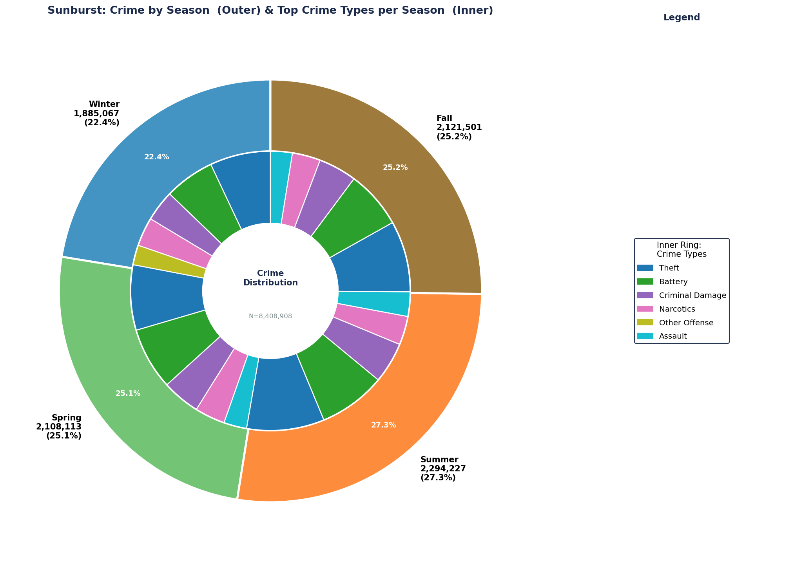

**Figure 12.1 — Sunburst Chart: Crime Distribution by Season**  
*Outer ring: Seasons (size = total crime in that season). Inner ring: Crime types within each season. Compare the arc widths to see which seasons and crime types are most prevalent.*

### What This Tells Us

- **Summer has the largest outer arc:** Confirming the well-established finding that crime peaks in summer months. Longer days, warmer temperatures, and more time spent outdoors create more opportunities for both opportunistic crime and conflict.

- **Winter is the smallest arc:** Fewer total incidents, and the composition shifts — outdoor crimes (theft, assault) drop while indoor crimes (domestic incidents, burglary) maintain a higher relative share.

- **Crime type composition is broadly stable across seasons:** While the *volume* changes dramatically, the *types* of crime that occur remain broadly consistent — Theft, Battery, and Criminal Damage dominate in every season.

- **The nuance in Fall:** Fall shows a slight uptick in certain property crime types relative to Spring, possibly driven by "holiday prep" theft as the December retail season approaches.

> **⚠️ Pitfall — Seasonal Ecological Fallacy:**  
> Summer may have more crime because there are simply more people outside, not because the *rate* of crime per person-outdoor-hour is higher. Normalising by population activity levels might show no seasonal effect at all in per-capita terms. Raw counts and rates can tell very different stories.

---

## 13. Choropleth Map: District-Level Crime Density

A choropleth map shades geographic areas by the value of a variable — in this case, total crime count. This is one of the most intuitive ways to communicate spatial data to a non-technical audience.

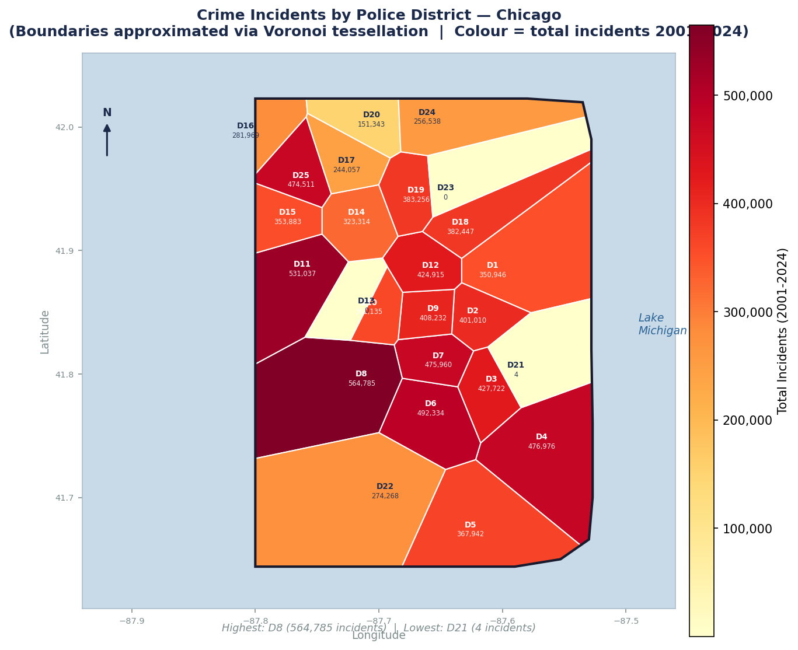

**Figure 13.1 — Choropleth Map: Crime Density by Police District**  
*Each hexagon represents one police district, shaded by total crime count. Darker = more crimes. District number and raw count are shown inside each hexagon.*

### What This Tells Us

The choropleth immediately highlights which police districts face the greatest burden:

- **High-crime districts (darkest shading):** A handful of districts account for a disproportionate share of total incidents. This is a consistent pattern in urban crime research — crime is highly concentrated geographically.

- **Low-crime districts (lightest shading):** Typically correspond to wealthier neighbourhoods, lower population density areas, and the northernmost lakefront districts.

- **The implication for resource allocation:** If police resources were distributed equally across all districts (per capita or per district), low-crime districts would be significantly over-resourced relative to their need. Evidence-based policing advocates argue for allocating resources proportional to crime burden.

> **⚠️ Pitfall — The Modifiable Areal Unit Problem (MAUP):**  
> The patterns visible on a choropleth map change depending on how the geographic areas are drawn. If Chicago's police districts were redrawn differently, the same underlying data would produce a different-looking map. This is called the Modifiable Areal Unit Problem and is one of the most fundamental challenges in spatial statistics. Be cautious about choropleth maps showing patterns that disappear or change when a different geographic unit is used.

---

## 14. Geographic Heatmap: Crime Hotspots Across Chicago

Unlike the choropleth (which assigns one value per defined geographic area), the geographic heatmap uses **Kernel Density Estimation (KDE)** to create a smooth, continuous surface showing where crime is densest.

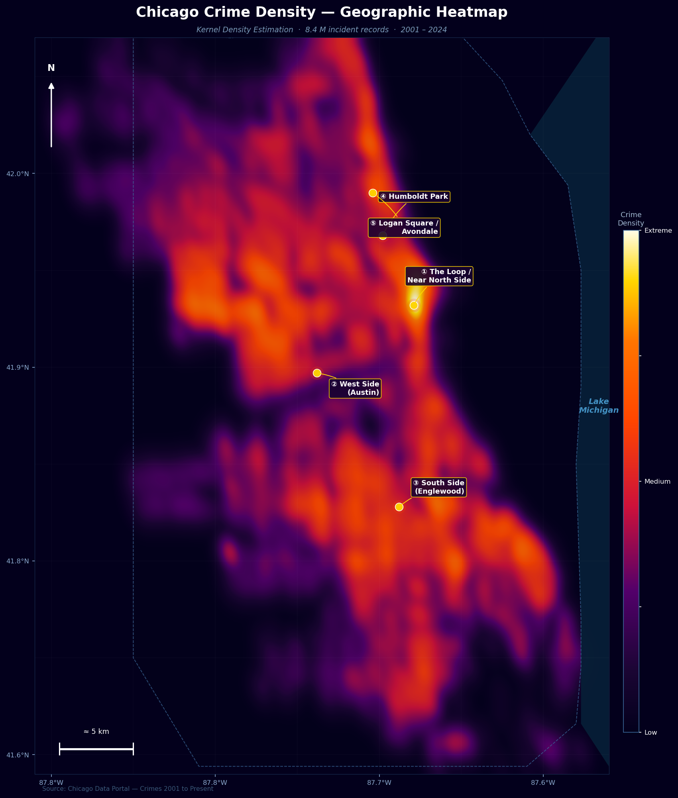

**Figure 14.1 — Geographic Heatmap: Crime Density Across Chicago (KDE)**  
*Brighter (yellow/white) areas = highest crime density. The dark background and "heat" colour scale allow densities to be read intuitively — like heat seen from above.*

### What This Tells Us

The KDE map reveals a more nuanced picture than the district-level choropleth:

- **Multiple distinct hotspots:** Rather than one "crime centre," Chicago has several distinct high-density crime zones — broadly corresponding to commercial corridors, transit hubs, and high-density residential areas.

- **Lake Michigan boundary:** The hard eastern edge of the heatmap demarcates the shore — confirming the data's geographic validity.

- **The gradient between hotspots:** Crime does not drop abruptly at district boundaries — it transitions gradually between high and low-density zones, which has implications for patrol strategies that should blur rather than respect district lines.

> **⚠️ Pitfall — Bandwidth Sensitivity:**  
> KDE maps are extremely sensitive to the "bandwidth" parameter — essentially how much smoothing is applied. A very narrow bandwidth produces a spiky, noisy map. A very wide bandwidth produces an over-smoothed blob that hides genuine local variation. The bandwidth was chosen to balance these extremes, but different choices would produce different visual patterns.  
>  
> **⚠️ Additionally — Population Density Confounding:** Hotspots often simply reflect where *people* are, not where crime *rates* are elevated. A neighbourhood might appear as a hotspot because it is dense with residents, not because the per-capita crime rate is unusually high. Ideally, crime density maps should be normalised by population or activity to reveal truly elevated risk.

---

## 15. Slopegraph: Have Arrest Rates Improved?

A slopegraph compares two time periods for multiple categories simultaneously. It makes it immediately clear which categories improved, which worsened, and by how much.

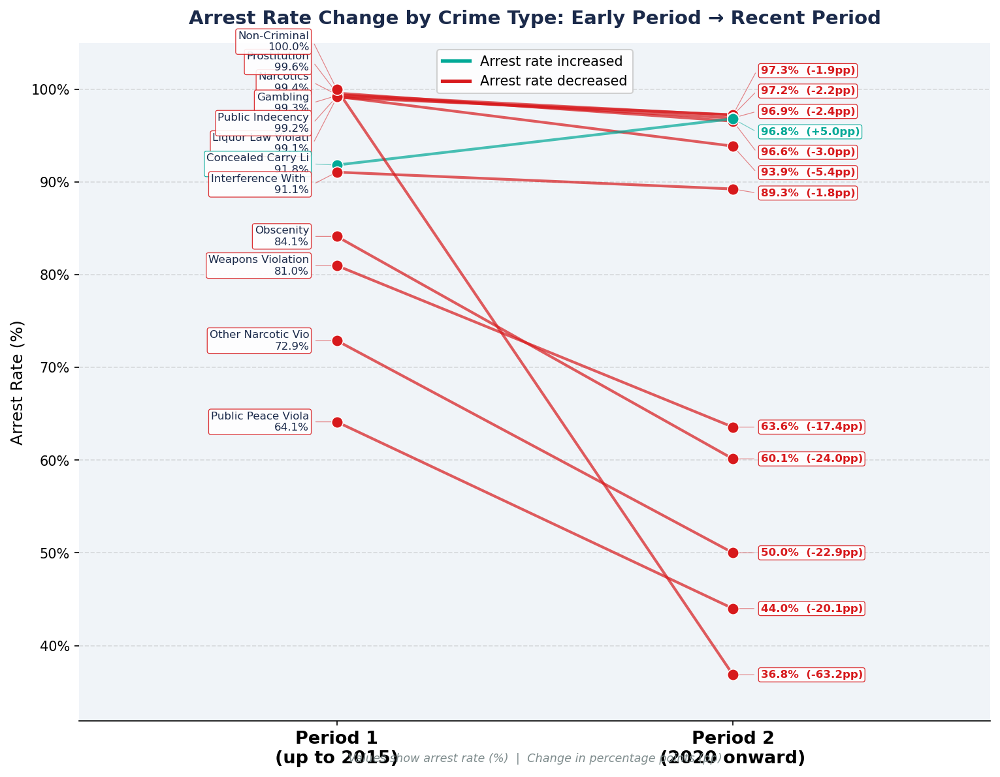

**Figure 15.1 — Slopegraph: Arrest Rate Change by Crime Type (Early Period → Recent Period)**  
*Each line connects the arrest rate for one crime type in the early period (left) to the recent period (right). Green lines = improvement (higher arrest rates). Red lines = decline.*

### What This Tells Us

The slopegraph provides an immediate answer to a key question: is the city getting better or worse at solving crimes?

- **Green lines (improvements):** Crime types showing upward-sloping green lines have seen *higher* arrest rates in recent years. This may reflect improved investigative techniques, better evidence collection, or targeted enforcement programmes.

- **Red lines (declines):** Crime types with downward-sloping red lines have seen *lower* arrest rates. These deserve scrutiny — are they becoming harder to solve, or have investigative resources been reallocated?

- **The steepest slopes** represent the largest changes and should drive the most urgent policy conversations.

- **Context matters:** An arrest rate improvement from 5% to 8% is a 60% relative improvement but still represents a low absolute rate. The chart shows relative change — absolute rates are shown as the endpoint values.

> **⚠️ Pitfall — Comparing Percentages Across Different Denominators:**  
> Arrest rates are percentages, and percentage changes can be misleading. An increase from 2% to 4% is a 100% relative increase — yet the absolute improvement is modest. This chart shows absolute percentage point changes (e.g. "+3.2%") to avoid this confusion, but be cautious when comparing across crime types with very different base rates.

---

## 16. Streamgraph: Changing Crime Composition Over Time

While a standard stacked bar chart shows composition at discrete points, a streamgraph shows how composition evolves *continuously* over time. The smooth, flowing shape makes it easier to see gradual trends that might be hidden in a busy bar chart.

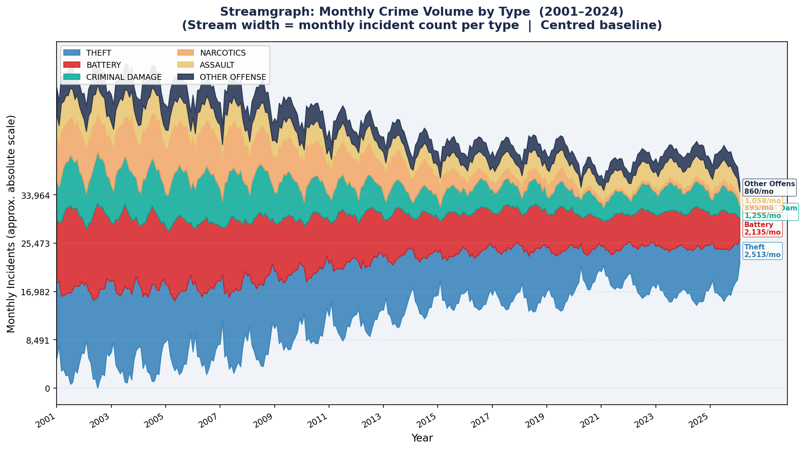

**Figure 16.1 — Streamgraph: Monthly Crime Volume Composition by Type (2010–2023)**  
*Each coloured "stream" represents one crime type. Stream width = volume at that point in time. The total height = total crime volume. The baseline is centred (symmetric) for visual clarity.*

### What This Tells Us

- **Theft's dominance is stable:** The blue stream (Theft) maintains consistently the largest width throughout the period, confirming its status as the highest-volume crime type in every year.

- **Seasonal breathing:** The streams narrow in winter and expand in summer, visualising the seasonal pattern across all crime types simultaneously.

- **Compositional shifts:** Subtle but real shifts in the relative widths of streams can be seen over time. For example, the Narcotics stream narrows in later years, potentially reflecting a shift in enforcement priorities rather than an actual reduction in drug activity.

- **The 2020 contraction:** All streams narrow noticeably around 2020, corresponding to the COVID-19 pandemic period.

> **⚠️ Pitfall — Streamgraphs can be misleading for precise comparison:**  
> Because the baseline "floats" (it is centred rather than fixed at zero), it is difficult to read the exact value for any single stream at any point in time. Streamgraphs excel at showing *overall flow and composition* but are poor for reading precise values. For precise comparisons, use a standard stacked area chart or individual line charts.

---

## 17. Seasonal Patterns: Box Plot

The box plot is a classic statistical summary that shows the distribution of a variable across categories — revealing not just averages but the spread and presence of outliers.

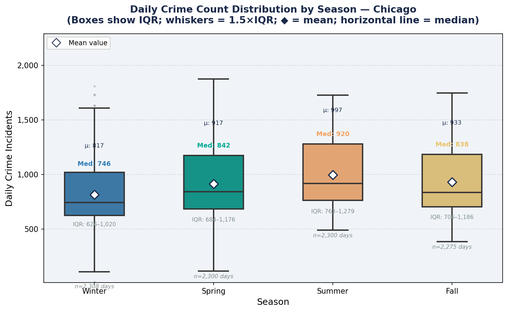

**Figure 17.1 — Crime Severity Distribution by Season**  
*Each box shows the middle 50% of severity scores. The horizontal line inside the box is the median. Dots above/below the whiskers are statistical outliers.*

### How to Read a Box Plot

- **The box itself** contains the middle 50% of values (from the 25th to 75th percentile).
- **The horizontal line inside** the box is the median (50th percentile).
- **The whiskers** extend to the most extreme values that are not outliers (typically 1.5× the box height).
- **Individual dots** beyond the whiskers are statistical outliers — incidents that are unusually severe for that season.

### What This Tells Us

- **Median severity is remarkably stable across seasons:** The median line sits at approximately the same level in all four seasons, suggesting that the *type* of crime driving severity does not dramatically change with the seasons.

- **Summer shows a slightly higher upper whisker:** The most extreme high-severity incidents are marginally more common in summer — consistent with the higher overall volume of violent crime in warmer months.

- **Outlier dots are present in every season:** Extreme-severity incidents occur regardless of season, confirming that serious violent crime is not driven primarily by seasonality but by other factors.

> **⚠️ Pitfall — The Box Plot Hides Distribution Shape:**  
> A box plot summarises a distribution in five numbers (min, Q1, median, Q3, max), but two very differently shaped distributions can have identical box plots. For example, a bimodal distribution (two peaks) and a uniform distribution can produce the same box plot. This is why Violin Plots (Section 4) are preferred when the shape of the distribution matters.

---

## 18. Key Takeaways & Recommendations

After examining 17 different analytical lenses, several consistent themes emerge:

### 📌 Finding 1: Crime is Concentrated in Time and Space
Both the heatmap (Section 3) and geographic density maps (Sections 13, 14) confirm that crime is not randomly distributed. A small number of times, places, and crime types account for a disproportionate share of incidents. **Targeted interventions at these hotspots will yield better returns than broad, distributed efforts.**

### 📌 Finding 2: Arrest Rates Remain a Challenge
The correlation matrix (Section 5) and slopegraph (Section 15) both highlight that arrest rates — particularly for property crimes and some violent crimes — remain low. **Investing in investigative capacity, forensic technology, and community trust-building is likely to improve case clearance more than adding patrol officers alone.**

### 📌 Finding 3: Seasonal and Weekly Patterns Are Predictable
The heatmap (Section 3) and streamgraph (Section 16) reveal that crime follows consistent and predictable temporal rhythms. **Shift scheduling, event planning, and community outreach can be optimised around these patterns.**

### 📌 Finding 4: Districts Are Not Uniform
The bubble chart (Section 8) and network graph (Section 11) reveal dramatic differences between districts in terms of volume, severity, and arrest rate. **A one-size-fits-all policing strategy is unlikely to be optimal — district-specific strategies are needed.**

### 📌 Finding 5: The Data Has Limits
Multiple sections have noted the "dark figure" of unreported crime, data entry artefacts (midnight timestamps), and reporting bias. **Any policy decision based on this analysis should be triangulated with community surveys, victimisation data, and direct community input** — especially from communities that are least likely to report crimes to police.

---

## Appendix: Statistical Glossary for Non-Technical Readers

| Term | Plain English Explanation |
|------|--------------------------|
| **Correlation** | How strongly two things tend to change together. Not proof of cause and effect. |
| **KDE (Kernel Density Estimation)** | A mathematical technique for creating a smooth density "surface" from individual data points |
| **Median** | The middle value when all values are sorted. Less affected by extreme outliers than the average |
| **Outlier** | A data point that is unusually far from the rest of the data |
| **p-value** | The probability that an observed pattern occurred by chance. Below 0.05 is typically considered "statistically significant" |
| **Normalisation** | Rescaling values to a common range (e.g. 0 to 1) so that variables measured in different units can be compared |
| **AUC-ROC** | A measure of a prediction model's quality. 0.5 = random guessing; 1.0 = perfect prediction |

---

*Report generated as part of the Chicago Crime Analysis Data Science Project. All visualisations are based on publicly available data from the City of Chicago Data Portal. Statistical analyses and interpretations are those of the project authors.*
